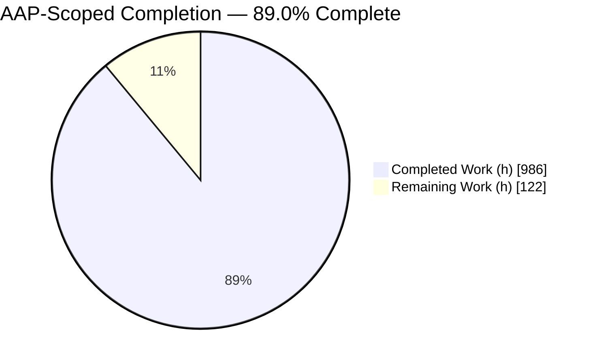
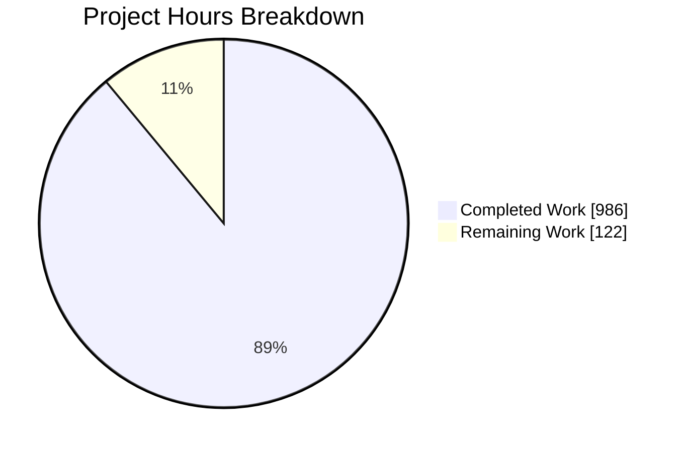
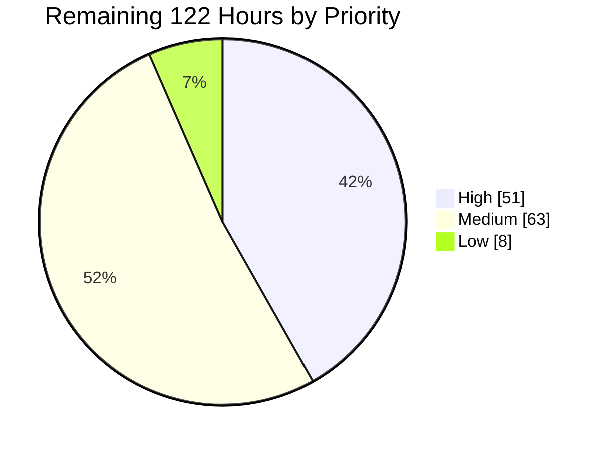
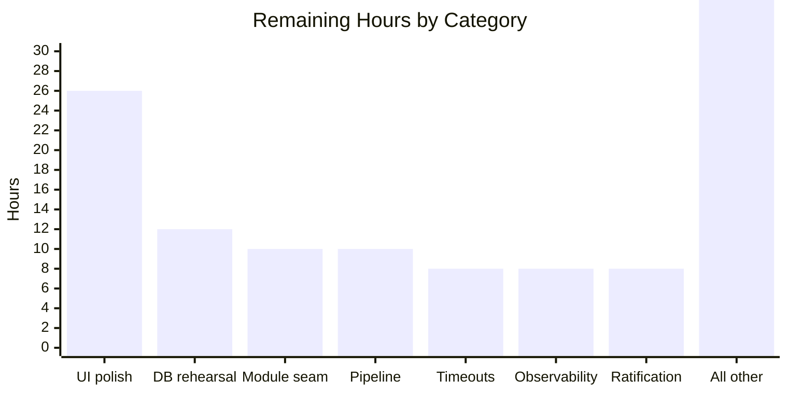
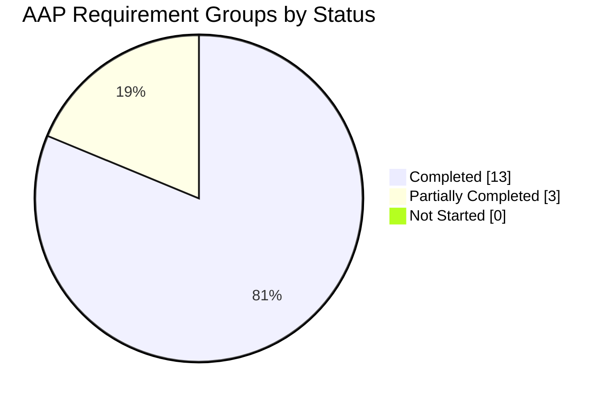

# 1. Executive Summary

## 1.1 Project Overview

This project migrates the DotNetNuke 4.9.0 content-management platform off VB.NET on .NET Framework 2.0 Web Forms and onto a containerised two-tier application: a C# 12 / .NET 8 ASP.NET Core Web API persisting through Entity Framework Core 8 against the existing, unaltered SQL Server schema, paired with an Angular 19 single-page administration console. Five domains are preserved — Portal, Module, User, Role and Permission — with Tab as a supporting aggregate. The audience is the operators of a multi-tenant DotNetNuke installation. The modern stack grows alongside the legacy trees, so the running legacy application carries no regression risk.

## 1.2 Completion Status



<!-- Chart colours: Completed = Dark Blue #5B39F3 · Remaining = White #FFFFFF -->

| Metric | Value |
|---|---|
| **Total Hours** | **1,108** |
| **Completed Hours (AI + Manual)** | **986** (986 AI + 0 manual) |
| **Remaining Hours** | **122** |
| **Percent Complete** | **89.0%** |

Measured against plan scope only: `986 / (986 + 122) × 100 = 89.0%`.

## 1.3 Key Accomplishments

- ✅ Six-project .NET 8 solution builds clean under `--warnaserror` — 0 warnings, 0 errors — with Clean Architecture layering enforced by the compiler.
- ✅ 21 entities bound to the terminal legacy schema by 21 Fluent configurations, with an empty baseline migration and no code path able to alter a table.
- ✅ 13 controllers expose 83 version-prefixed actions behind policy authorisation, JWT sessions with refresh rotation, and RFC 7807 on every failure.
- ✅ Angular 19 console delivers 20 screens over 22 lazy routes — no NgModules, all 38 components on `OnPush`, tokens in memory only.
- ✅ 12,141 automated tests pass (5,360 backend, 6,781 front-end) at 95.36% front-end statement coverage.
- ✅ Two Alpine images run as a healthy pair; the API starts non-root and its anonymous health endpoint releases the SPA container.
- ✅ All seven planned validation gates pass end to end, both container gates included.
- ✅ Purely additive — 813 files added, none modified or deleted; both legacy trees provably untouched.

## 1.4 Critical Unresolved Issues

| Issue | Impact | Owner | ETA |
|---|---|---|---|
| Module content export and import are offered in the API and the console but always refuse for stored modules, because no keyed business controller can be registered from outside the Infrastructure assembly | An advertised capability fails for every real module | Backend | 10h |
| Refresh tokens do not survive an API restart and the topology is capped at one API instance until the shared durable store is provisioned | Users re-authenticate after every deploy; rolling or scaled-out deployment breaks rotation | Backend / Platform | 6h |
| No coordinated elapsed-time budget at any tier — no proxy, request, command or client timeout outside the refresh-token store | A stalled dependency leaves operations pending indefinitely and holds connections | Backend / Platform | 8h |
| First contact with a real DotNetNuke 4.9 database is unproven; every persistence test runs against a locally provisioned, schema-faithful database | Mapping or credential-migration surprises would surface at cut-over | Backend / DBA | 12h |
| Deployment secrets and TLS are unprovisioned — the connection string and signing key ship as placeholders and the API enforces no transport security without the TLS overlay | Cannot be deployed to a real environment as configured | Platform / Security | 6h |
| 13 high-severity dependency advisories are carried on the pinned Angular 19.2.x graph, six rooted in the framework with no in-major remedy | Inherited exposure until the framework major is raised; each measured unreachable here | Frontend / Security | 4h |

## 1.5 Access Issues

| System / Resource | Type of Access | Issue Description | Resolution Status | Owner |
|---|---|---|---|---|
| Production DotNetNuke 4.9 SQL Server | Database connection | No production or production-shaped instance is reachable; persistence is exercised against a locally provisioned schema-faithful database built from the repository's own scripts | Open — blocks the first-run rehearsal | DBA |
| Secret manager / vault | Credential storage | `DB_CONNECTION_STRING` and `JWT_SECRET` are supplied from a local, uncommitted environment file; no managed secret source is wired | Open | Platform |
| TLS certificate and private key | Certificate issuance | The TLS overlay is present and configured but no certificate is installed, so the default topology serves cleartext on loopback only | Open | Platform / Security |
| Container registry | Push credentials | Both images build locally and are tagged `:latest`; no registry is configured to publish them | Open | Platform |
| CI/CD system | Pipeline execution | The repository carries no workflow or pipeline definition, so the seven validation gates are run by hand | Open | Platform |

Nothing above blocked validation here: the full toolchain and a container runtime were present, and all seven gates ran.

## 1.6 Recommended Next Steps

1. **[High]** Rehearse first contact with a real DotNetNuke 4.9 database — the empty baseline as a no-op, all 21 mappings, and the credential re-hash path.
2. **[High]** Make module export and import either work or disappear by closing the registration seam.
3. **[High]** Provision the deployment surface — managed secrets, the CORS origin, TLS, and the shared refresh-token store.
4. **[High]** Install a timeout ladder across proxy, request pipeline, data provider and client.
5. **[Medium]** Stand up a pipeline running all seven gates, and wire the audit stream to a real sink.

# 2. Project Hours Breakdown

## 2.1 Completed Work Detail

Every row traces to a specific Agent Action Plan deliverable and to artefacts present in the repository.

| Component | Hours | Description |
|---|---|---|
| Solution scaffolding and build policy | 12 | `backend/DnnMigration.sln` with six projects, `Directory.Build.props` (net8.0, LangVersion 12.0, nullable enabled, warnings-as-errors, exactly two sanctioned suppressions), `global.json` pinned to SDK 8.0.423, `.editorconfig`, `NuGet.Config`, six `.csproj` |
| Domain layer | 46 | 21 entities, 13 enums, 3 value objects, 10 repository abstractions, 11 service abstractions, 14 common types (`Result`, `PagedResult`, entity bases). Zero project references and zero package references, so a layering breach is a compile error |
| Infrastructure persistence | 76 | `DnnDbContext`, design-time factory, unit of work with corrected savepoint ownership, 21 Fluent configurations name-aligned 1:1 with the entities (21 `ToTable`, 194 `HasColumnName`) against the 88-script terminal schema, an intentionally empty baseline migration, 9 repositories with collation-safe filters |
| Application layer | 118 | 7 services absorbing roughly 5,760 lines of legacy static controllers plus 39 admin code-behinds; 14 abstractions, 73 DTOs, 6 hand-written mappers, 45 FluentValidation validators, 5 bound options classes |
| Infrastructure security and platform services | 40 | BCrypt hasher, JWT token service with refresh rotation and a replay-refusing store, permission evaluator, system clock, memory cache behind `ICacheService`, host-settings service, module business-controller factory, portal-context accessor, three health checks |
| API layer | 72 | `Program.cs` composition root with a fixed pipeline order, 13 controllers exposing 83 actions (36 GET, 23 POST, 15 PUT, 9 DELETE), 8 registration extensions, 10 middleware, 11 authorization types, RFC 7807 handler and validation factory, three `appsettings` overlays |
| Backend test estate | 132 | 141 test files, `WebApplicationFactory` fixture, test-database factory, authenticated client factory, three embedded schema scripts and a terminal-schema manifest; 5,360 tests |
| Frontend workspace, build config and design tokens | 28 | `package.json` and committed lock file, `angular.json` emitting `dist/dnn-migration`, three strict `tsconfig` files, `karma.conf.js` with sandbox-free launchers, `.nvmrc`, seven SCSS files carrying a token vocabulary measured from the legacy stylesheets, three environment files |
| Frontend core layer | 64 | 12 models, 20 typed HTTP services, 6 functional interceptors, 6 route guards, 17 Signal stores, endpoint catalogue and utilities |
| Shared component library and application shell | 56 | 11 shared components, 12 directives including permission gating, 4 pipes, and a five-region shell — all `OnPush`, all token-only, all with semantic landmarks and live regions |
| Feature screens | 138 | 20 screens across portal (4), module (5), user (6), role (4) and auth (1), reached through 22 lazy routes, derived from the 39 legacy admin screens and their markup for field sets, validators and grid columns |
| Frontend test estate | 96 | 88 spec files driving 6,781 specs through `TestBed` and `HttpTestingController` |
| Container topology and reverse-proxy hardening | 26 | Two Alpine Dockerfiles, compose topology with a health gate, nginx with a late-resolving upstream, extracted proxy and static-asset contracts, a security-header set, a TLS overlay and a session-store provisioning script |
| Migration record, README and repository hygiene | 30 | `MIGRATION_NOTES.md` as the divergence register, a 1,561-line `README.md` covering both stacks and all seven gates, `.gitignore`, `.dockerignore` |
| Seven-gate validation execution | 18 | Build, both test suites, the front-end production build and spec run, and both container gates, executed end to end with evidence |
| Non-functional requirement implementation | 34 | Transport-security switch, short-lived tokens with rotation, origin-restricted CORS, rate limiting on credential endpoints, URL versioning, problem-details contract, correlation identifiers propagated end to end, structured audit logging with redaction, strict TypeScript, ahead-of-time build, memory-only token storage, content-security headers, lazy loading, change-detection strategy, preloading, accessibility, large-list virtualisation |
| **Total Completed** | **986** | |

## 2.2 Remaining Work Detail

| Category | Hours | Priority |
|---|---|---|
| Portal-screen and shared-shell polish register (approximately 32 minor and informational items) | 26 | Medium |
| First-run rehearsal against a real DotNetNuke 4.9 database | 12 | High |
| Module content export/import registration seam | 10 | High |
| CI/CD pipeline (none exists in the repository) | 10 | Medium |
| Coordinated elapsed-time budget across proxy, request, command and client | 8 | High |
| Production observability wiring and audit-vocabulary completion | 8 | Medium |
| Divergence ratification and plan amendment | 8 | Medium |
| Shared durable refresh-token store provisioning | 6 | High |
| Deployment secrets, CORS origin and TLS provisioning | 6 | High |
| Deployment runbook, strangler cut-over and rollback rehearsal | 6 | Medium |
| Tenant-address probe hygiene and single-segment address resolution | 5 | Medium |
| Dependency advisory review and framework-major plan | 4 | Medium |
| Test-estate hardening | 4 | Low |
| Load and capacity baseline | 4 | Low |
| Publish the OpenAPI specification as a deliverable artefact | 3 | High |
| Duplicate profile-answer purge defect | 2 | Medium |
| **Total Remaining** | **122** | |

## 2.3 Basis of Estimate

Completed hours are derived from the estimation bands the Agent Action Plan itself sets out, applied to artefacts counted in the repository. The five preserved domains sit in the complex-business-logic band, which is what puts the Application layer at 118 hours across 7 services that absorb roughly 5,760 lines of legacy static controllers plus 39 admin code-behinds. The 21 entities and their 21 schema-faithful configurations sit in the CRUD band with a fidelity premium for deriving the terminal schema from an 88-script upgrade chain and reading two independent provider stacks totalling some 289 stored procedures. Testing lands at 228 hours against roughly 600 hours of production authoring — 38%, inside the framework's 30–40% band — and is evidenced by 12,141 passing tests.

Confidence is high on fourteen of the sixteen completed rows, where the delivered artefacts were counted directly and the gates observed. It is medium on the Application layer and the feature screens, the two largest surfaces, where the split between authoring and iteration is inferred rather than measured. On the remaining side, confidence is high where the work is bounded and the files are named, medium on the provisioning and pipeline items, and deliberately low — hence padded — on the two items that depend on a production database and a load profile nobody has yet seen.

Total project hours are `986 + 122 = 1,108`, and the completion percentage used throughout this guide is `986 / 1,108 = 89.0%`.

# 3. Test Results

Every figure below comes from a run executed against the current tree. The backend suite runs against a live SQL Server 2022 instance; the front-end suite runs in headless Chrome 151 through the repository's sandbox-free Karma launcher.

| Area / Category | Framework | Tests | Passed | Failed | Coverage | What This Proves |
|---|---|---|---|---|---|---|
| Domain, application services, mappers and validators | xUnit 2.9.3 | 3,270 | 3,270 | 0 | Not instrumented | Business rules ported from the legacy controllers behave as specified in isolation from the database, including the identity-seed and sentinel boundaries |
| Persistence against the legacy schema | xUnit + EF Core 8 on SQL Server 2022 | included in 2,090 | all | 0 | Not instrumented | The 21 entity mappings resolve against real tables and columns, and the model has no pending changes against its snapshot |
| API contracts end to end | xUnit + `WebApplicationFactory` | included in 2,090 | all | 0 | Not instrumented | Every resource answers its documented status codes and envelopes, and every non-2xx carries an RFC 7807 document with a correlation identifier |
| Security, sessions and authorisation | xUnit + `WebApplicationFactory` | included in 2,090 | all | 0 | Not instrumented | Credentials hash one-way, refresh tokens rotate single-use and refuse replay, and policy authorisation refuses across tenants |
| Concurrency and write races | xUnit + `WebApplicationFactory` | included in 2,090 | all | 0 | Not instrumented | Two simultaneous writers holding one token produce exactly one success and one conflict, with no lost update; parallel role grants leave exactly one row |
| Integration suite total (trait-selected) | xUnit, `Category=Integration` | 2,090 | 2,090 | 0 | Not instrumented | The whole integration estate is selectable by its trait alone — the unit assembly matches nothing under that filter |
| Angular console — components, services, interceptors, guards, stores, pipes, directives | Karma 6.4 + Jasmine 5.6, headless Chrome | 6,781 | 6,781 | 0 | Statements 95.36%, branches 85.84%, functions 97.56%, lines 95.36% | Every screen, store and transport concern behaves as specified, including paged envelopes, problem-document rendering, absent-value discipline and live-region announcements |
| **All automated tests** | **xUnit + Karma** | **12,141** | **12,141** | **0** | Front end 95.36% statements | The delivered surface is green on the current tree in one run, with nothing failed and nothing skipped |

### Not Covered

The following was delivered but is not exercised by any automated test. Each should be tested by a human before release.

- **A real DotNetNuke 4.9 database.** All 2,090 persistence and API tests run against a locally provisioned database built from the repository's own schema scripts. The accumulated drift of an 88-script upgrade chain, and the externally installed `aspnet_*` membership objects those scripts only alter, are not represented. Test the mappings and the credential re-hash path against a restored production copy.
- **The module content export/import payload round trip.** Both screens render, validate, submit and are spec-covered, but a full export-then-reimport with content comparison has never been performed; it needs a second tenant to be meaningful.
- **The TLS overlay.** The TLS compose file and nginx template are not part of the default two-container topology, so no run exercises them. Bring the overlay up with a real certificate and confirm redirection, HSTS and the forwarded-scheme handling.
- **Two shared directives.** The focus-first-invalid and submit-guard directives carry no unit specs of their own. Both were confirmed by driving a browser, and 14 existing specs exercise the submit guard indirectly, but neither has a dedicated regression net.
- **Three conditional branches that stored data cannot currently reach.** The conflict path on the membership-settings write, the "no data type chosen" sentinel branch of the profile-definition grid, and the renewal-refusal wording that a session teardown always pre-empts. Each is reasoned and spec-covered where possible, but no run has observed it.
- **Load, capacity and endurance.** No throughput, latency or soak target is asserted anywhere, and none was measured. Establish a baseline against the real schema before sizing the connection pool or the rate-limit windows.
- **Pointer-hover styling.** Seven `@media (hover: hover)` blocks are inert in a headless environment and were confirmed only by reading the resolved style rules.

# 4. Runtime Validation & UI Verification

The two-container topology was started, driven and torn down against a live SQL Server instance holding a seeded tenant. Every line below records what was observed, not what was expected.

- ✅ **Start-up and health** — `docker compose up -d` took the API from `Started` to `Waiting` to `Healthy`, and that transition released the SPA container through its `condition: service_healthy` gate. `/health`, `/health/live` and `/health/ready` each answered **200 anonymously** with the documented health document; the API process runs as **uid 1000 (`appuser`)**, not root; `docker compose down` removed both containers and the network cleanly.
- ✅ **Reverse proxy and SPA delivery** — the SPA origin answered **200** with a 4,428-byte document; `/api/v1/...` requests reached the API through the proxy; the SPA origin deliberately refuses the API health paths with **404** and answers its own `/nginx-health` with **200**.
- ✅ **Authentication** — sign-in returned **200** with an access and refresh token pair and the signed-in identity; the token carried the correct portal claim with a one-hour lifetime; a wrong credential returned **401** with the `auth.invalid_credentials` problem type; an anonymous read returned **401** with `auth.unauthenticated`. Tokens are held in memory only — every full document reload signs the operator out, confirmed by driving it.
- ✅ **API read surface** — 16 authenticated reads across portals, aliases, pages, users, user settings, roles, role groups, permissions, module definitions, modules, profile definitions and both tenant-addressing endpoints all answered **200** for a host account.
- ✅ **Portals, settings and aliases** — the listing rendered 10 rows across 9 columns reconciled cell-by-cell against the API payload; the settings screen rendered both tabs with populated fields; the alias listing rendered all 8 seeded rows. Protective affordances held: the current portal offers no Delete and the alias currently serving the browser reads "In use" instead of Edit.
- ✅ **Accounts, profiles and membership** — the accounts listing opened in its configured prompt-first state, then rendered 10 of 18 rows once "All" was chosen; an account record rendered all five credential fields and eight membership rows; membership settings rendered fifteen-plus bound controls plus a nine-row services region. The prompt-first behaviour is provably a stored setting, not a defect.
- ✅ **Roles, groups and assignment** — the roles grid rendered 10 of 12 rows with the administrators role correctly withholding both Edit and Delete behind a "Protected" badge and a screen-reader explanation; a role record rendered its name, description, fee and billing term.
- ✅ **Modules** — the module listing rendered 8 of 8 placements with expiry, visibility and all-pages state; per-row Edit, Settings, Export and Delete commands were present; the permission grid becomes editable when inheritance is switched off.
- ✅ **Cross-cutting behaviour observed live** — origin-restricted CORS (never a wildcard), the `X-Correlation-Id` header emitted by the client and echoed back identically by the server, `api-supported-versions: 1.0`, and a full header set including content-security policy, `nosniff`, frame options, referrer policy, permissions policy, cross-origin-opener policy and no-store on credential responses. Four stored cross-site-scripting payloads in seeded titles and descriptions rendered as inert literal text.
- ⚠ **One cosmetic residue** — a cold document load whose first path segment is unrecognised probes the tenant-address endpoint beneath that segment and is answered **401** rather than a clean negative, which the browser surfaces as a single console entry. The user-visible outcome is correct: a proper Not Found view renders. On every other screen exercised, the browser console recorded **zero messages of any level** and **no response at or above 400**.

**Never exercised at runtime:** the TLS overlay, because it is not part of the default topology; module export/import against a real payload, because no keyed business controller is registered and a second tenant would be needed; and any behaviour that depends on a production DotNetNuke database, because none was reachable. Nothing else in the delivered surface was left undriven.

# 5. Compliance & Quality Review

## 5.1 Compliance Matrix

Each row records where the deliverable stands now, against the benchmark the Agent Action Plan set for it.

| # | Deliverable / Benchmark | Status | Progress | Evidence |
|---|---|---|---|---|
| 1 | Language and framework migration — idiomatic C# 12 on `net8.0`, nullable enabled, warnings as errors | ✅ Pass | 100% | `backend/Directory.Build.props` sets every required property with exactly the two sanctioned suppressions; the six-project Release build reports 0 warnings and 0 errors |
| 2 | Clean Architecture layering enforced by the compiler (Rule T1) | ✅ Pass | 100% | Domain → nothing; Application → Domain; Infrastructure → Domain + Application; Api → Application + Infrastructure. Domain declares zero `PackageReference` entries |
| 3 | No business logic above the Application layer; all data access behind repository interfaces (Rules T2, T3) | ✅ Pass | 100% | `DnnDbContext` appears in no file outside `DnnMigration.Infrastructure`; controllers delegate and translate results only |
| 4 | Schema immutability — bind to the terminal legacy schema, alter nothing (Rule T4) | ✅ Pass | 100% | 21 `ToTable` and 194 `HasColumnName` bindings; the baseline migration is 16 lines with no `CreateTable`, `AlterTable` or `DropTable`; no `EnsureCreated` or `Migrate` call site exists |
| 5 | Asynchronous throughout, no synchronous bridging (Rule T6) | ✅ Pass | 100% | No `.Result`, `.Wait()` or `GetAwaiter().GetResult()` in `backend/src` |
| 6 | Legacy sentinels preserved at the boundary, not in the domain (Rule T7) | ✅ Pass | 100% | Domain properties are nullable CLR types; the console renders the `-1` sentinel as an explicit absent-value mark with accessible text rather than printing it |
| 7 | Angular 19 architecture — standalone components, Signals, built-in control flow, `OnPush`, strict TypeScript | ✅ Pass | 100% | Zero `@NgModule` declarations; 38 of 38 components on `OnPush`; zero `*ngIf`/`*ngFor` against 363 built-in control-flow blocks; `strict` plus `strictTemplates` |
| 8 | Purely additive change set; legacy trees, solutions and documentation site untouched | ✅ Pass | 100% | 813 files added, 0 modified, 0 deleted, 0 renamed; `Library/`, `Website/`, `docs/`, `mkdocs.yml`, `catalog-info.yaml` and both legacy solutions all show zero changed files |
| 9 | Seven validation gates | ✅ Pass | 100% | All seven executed on the current tree — build, both test runs, front-end build and specs, both container gates |
| 10 | Zero placeholders, stubs or dead work markers | ✅ Pass | 100% | No `TODO`, `FIXME`, `HACK` or `NotImplementedException` marker in `backend/src`, `backend/tests` or `frontend/src`; no empty catch block; no hardcoded credential |
| 11 | Non-functional requirements across both stacks | ⚠ Partial | 97% | Eighteen of nineteen rows verified, several live against the running containers. The generated OpenAPI document is mounted only in Development or behind an explicit opt-in, and no specification artefact is published |
| 12 | Module registration and lifecycle preserved as a domain concern | ⚠ Partial | 60% | The factory, its contracts and its refusal path exist and are tested, but no keyed business controller can be registered from outside the Infrastructure assembly, so content export and import cannot run for stored modules |

## 5.2 AAP & Rule Divergences and Gaps

No user-specified rules were provided for this project — the rules document contains only a statement of their absence, and the Agent Action Plan records the same and substitutes its own normative sections. Every divergence below is therefore a departure from the plan, not from a user rule.

| # | What the AAP/Rule Required | What Was Delivered Instead | Why It Diverged | Impact | Remediation |
|---|---|---|---|---|---|
| 1 | Four container artefacts preserved verbatim, publishing `8080:8080` and `4200:80` | Eleven tracked files under `docker/`, both ports narrowed to `127.0.0.1`, and a late-resolving proxy upstream with a problem-document 503 | The verbatim clause collided with the plan's own transport-security requirement, and the literal upstream made an API-only redeploy a silent total outage | None on the gates; removes cleartext exposure off loopback and survives an API redeploy | Ratify the artefact set and the loopback publication in the plan |
| 2 | A nine-value colour vocabulary with `--color-danger: #ff0000`, accessibility ranked third "with zero visual change" | Eleven colour tokens, `--color-danger: #B00000`, and a new `--color-border-control: #767676` | The mandated red and greys failed WCAG contrast for text and boundaries on every screen | Destructive and error text now measure 7.38:1 and boundaries 4.54:1; hue and weight preserved | Amend the token vocabulary in the plan |
| 3 | A controller inventory with a read-only permissions catalogue and no tenant-addressing endpoints | A module-permission write action, two account-projection actions, and two whole tenancy controllers | The legacy permission grid needs a write path, personal data must leave the request target, and only the alias rows can tell a typo from a child portal's segment | Additive; no enumerated route changed shape or authorisation | Ratify the API inventory |
| 4 | A module business-controller factory reproducing install, configure and remove semantics over a DI-registered set | The factory and its refusal path, with zero keyed registrations and internal capability contracts | Every module class the legacy schema seeds is a bundled module the plan explicitly excludes, so no adapter could be authored | Export and import are advertised and always refuse for stored modules | Promote the contracts, publish a registration extension, withhold the affordance |
| 5 | A singleton token service, a frozen schema, a frozen dependency set and a two-service topology | A process-local refresh-token store, with an opt-in shared store that provisions its own separate catalogue | Those four constraints jointly rule out a table, a cache client and a third service | A restart invalidates outstanding refresh tokens; one API instance until the shared store is provisioned | Provision the separate catalogue and switch the provider |
| 6 | Alias resolution after authorisation; the middleware as the sole request-context consumer; a `PortalId` wrapper forbidding `-1`-as-absent | Resolution before authorisation, the accessor in two API authorization types, and portal identifiers carried as plain integers | Behind authorisation every tenant-scoped policy ran with no arrival tenant; adopting the wrapper needs converters across 21 configurations for no behavioural gain | The confinement invariant holds; zero as-absent comparisons exist in the backend | Ratify, or schedule the conversion as its own work |
| 7 | Behavioural equivalence with the legacy screens | Exact alias matching, no password retrieval, no paid self-subscription, a synchronous display-name sweep, no localisation runtime, no CAPTCHA | The plan permits divergence where equivalence is impossible or the legacy behaviour is itself a defect | Each is recorded in the migration register; the alias change removes a tenant mis-resolution hazard | Decide whether paid self-service and localisation are wanted as separate scope |
| 8 | A closed dependency inventory and a two-entry warning suppression list | Two test-only security pins, a 4 kB → 5 kB style-budget warning threshold, and an obsolete compose key retained | Advisories had to be cleared without an upgrade the plan forbids, and verbatim preservation outranks a cosmetic warning | The suppression list was never widened; both pins are test-only and reach no shipped artefact | Re-measure when the framework major is raised |

**1 — Container artefacts and port publication.** `docker/` now tracks eleven files: the four preserved originals plus `.env.example`, an extracted `api-proxy.conf` and `spa-static.conf`, a `security-headers.conf`, a TLS overlay pair, and `sql/refresh-token-store.sql`. Both ports publish on loopback rather than all interfaces. The literal `proxy_pass http://api:8080/api/` resolves its upstream once at start-up, so an API-only redeploy turned the whole application dark; a resolver-plus-variable upstream now recovers within a bounded window, and an unreachable API is reported as an RFC 7807 503. Extracting the proxy contract makes the plain and TLS servers unable to diverge. Every behaviour the plan specifies — the six forwarded headers, the `/api/` route, the asset policy, the SPA fallback — is present and was verified at runtime.

**2 — Design-token colour vocabulary.** Measured against the backgrounds actually painted, the mandated red gave 4.00:1 on white, 3.45:1 on the surface grey and 2.61:1 on a selected row, and the two boundary greys roughly 1.6:1 and 1.4:1 — so validation text, destructive labels and every field boundary sat below threshold on every screen. `frontend/src/styles/_tokens.scss` now ships `--color-danger: #B00000` and adds `--color-border-control: #767676`, keeping the legacy hue and weight; destructive text measures 7.38:1 and boundaries 4.54:1. `frontend/src/styles/tokens.spec.ts` pins the obligation so it cannot silently regress. Decide whether to amend the plan's vocabulary or accept eleven tokens.

**3 — API surface beyond the enumerated inventory.** Delivered beyond the inventory: `PUT /api/v1/modules/{id}/permissions`, `GET /api/v1/users/choices`, `POST /api/v1/users/search`, and two whole controllers — `TenancyController` at `/api/v1/tenancy/path-prefix` and `TenantAddressController` at `/api/v1/tenant-address`. The permission grid the plan requires cannot function without a write path; a slim account projection is needed for pickers the browser must load; personal data cannot sit in a request target; and a mistyped console route and a child portal's path segment are the same shape, so only the server's alias rows can distinguish them. Nothing the plan enumerated changed shape or authorisation. Ratify the inventory, or remove the additions and accept the capability loss.

**4 — Module content export and import.** The factory exists, refuses cleanly with a stable error code, and is tested — but production registers zero keyed controllers, and the three capability contracts are internal nested types inside `backend/src/DnnMigration.Infrastructure/Services/ModuleBusinessControllerFactory.cs`, so the documented registration mechanism cannot be reached from outside that assembly. The nine module classes the legacy schema seeds are all bundled modules the plan places out of scope, so no adapter for them could legitimately be authored. The consequence is user-visible: export and import are offered in both the API and the console and always fail for a real module. Promote the contracts, publish a registration extension, and reconcile the portability projection.

**5 — Refresh-token durability and the single-instance cap.** Four plan constraints act together: the schema is frozen, so no token table may be added; the dependency inventory is frozen, so no cache client may be introduced; the topology is fixed at two services; and the token service is specified as a singleton, which may not capture a scoped context. The delivered store is therefore process-local, with a SQL-backed alternative behind `IRefreshTokenStore` that provisions its own separate catalogue and refuses any configuration colliding with the application's own. An API restart invalidates every outstanding refresh token — users re-authenticate, no data is lost — and the topology is capped at one instance. Both facts are validated at start-up and reported by a health probe.

**6 — Pipeline ordering and the identifier wrapper.** Alias resolution is registered after authentication and before authorisation, because behind authorisation every tenant-scoped policy was evaluated on requests that had no arrival tenant, degrading a three-sided check to a two-sided one exactly where a host name resolved to nothing. The request-context accessor is injected in two API-layer authorization types instead; the invariant the plan expressed — that no layer below the API can reach ambient request state — holds and is enforced by the reference graph. Separately, `PortalId` exists and is tested but production code carries plain integers; adopting it would need value converters across all 21 configurations for no behavioural gain, and no as-absent comparison exists anywhere in the backend today.

**7 — Legacy behaviours deliberately not reproduced.** Six differences are carried on purpose and recorded in the migration register. Alias resolution matches whole segments rather than the legacy substring `LIKE`, removing a genuine multi-tenant mis-resolution hazard. Password retrieval is gone: credentials hash one way, with re-hash on first successful sign-in and administrative reset as the fallback. Paid self-subscription to a role stops at the catalogue, because the payment pages belong to an excluded tree; administrators can still assign any role. The display-name sweep is synchronous and transactional, so a mid-sweep failure cannot leave a tenant half-renamed. Localisation is not ported — resource files were read for wording only. CAPTCHA disappeared with its excluded control.

**8 — Dependency and build-policy deltas.** The integration-test project pins `SSH.NET` at the only version clearing a high-severity advisory that arrives transitively through the container-test library, plus a SQLite native bundle; both are test-only, neither is called, and the alternative was an upgrade the plan explicitly checked and rejected. The per-component style warning threshold rose from 4 kB to 5 kB, error ceiling untouched, when a stylesheet grew. The obsolete top-level `version` key stays in the compose file, printing one warning line per invocation, because removing it would edit a preserved example. Thirteen high-severity front-end advisories remain accepted under the plan's own decision that a dependency audit must not gate the build; each was measured unreachable in this application.

# 6. Risk Assessment

These are forward-looking: what could still go wrong once this is deployed.

| Risk | Category | Severity | Probability | Mitigation | Status |
|---|---|---|---|---|---|
| First contact with a real DotNetNuke 4.9 database is unproven — every persistence test runs against a locally provisioned, schema-faithful database rather than an instance carrying 88 upgrade scripts of drift and externally installed `aspnet_*` membership objects | Technical | High | Medium | Restore a production copy, apply the empty baseline as a no-op, resolve all 21 mappings against it, and exercise the credential re-hash path on real reversibly-encrypted passwords before any cut-over | Open |
| Transport security is not enforced by the API process by default; the running container logs that fact, and the default topology publishes cleartext on loopback only | Security | High | Medium | Deploy the TLS overlay with a certificate whose private key is readable by the proxy user, set the known-networks list, and enable the redirect | Open |
| Deployment secrets are placeholders — the connection string is empty and the signing key is a `CHANGE_ME` literal in the committed template | Security | High | Low | Source both from a managed secret store; compose refuses to start without them, which is what keeps the failure loud | Open |
| The API is capped at one instance and refresh tokens do not survive a restart, because the default token store is process-local | Operational | Medium | High | Provision the separate session catalogue, switch the store provider, and confirm rotation survives a restart and holds across two instances | Open |
| No coordinated elapsed-time budget — no proxy, request, command or client timeout outside the refresh-token store — so a stalled dependency leaves operations pending and holds connections | Technical | Medium | Medium | Add a documented ladder: proxy connect/send/read, a request-timeout policy with a longer allowance for export and import, a provider command timeout, and one shared client helper | Open |
| Module content export and import are advertised from the stored capability bit but always refuse, because no keyed business controller can be registered from outside the Infrastructure assembly | Technical | Medium | High | Promote the capability contracts, publish a registration extension, and withhold the affordance where nothing is registered | Open |
| Thirteen high-severity dependency advisories are carried on the pinned front-end graph, six of them rooted in the framework with no remedy inside the mandated major version | Security | Medium | Low | Each was measured unreachable in this application — no server-side rendering, no server platform package, no hydration provider. Re-measure and plan the framework-major move | Accepted with caveat |
| The two-container topology has only ever run on a single host with fixed container names, one instance of each service, and no ingress, registry or orchestrator in front of it; there is also no delivery pipeline and no configured log sink | Integration / Operational | Medium | Medium | Write the deployment runbook and rollback rehearsal, stand up a pipeline that runs all seven gates and publishes both images, and wire the structured audit stream to a real sink with alerts | Open |

# 7. Visual Project Status

Colour convention throughout: **Completed / AI Work = Dark Blue `#5B39F3`**, **Remaining / Not Completed = White `#FFFFFF`**, headings and accents Violet-Black `#B23AF2`, highlights Mint `#A8FDD9`.

### Overall Hours — 89.0% Complete



<!-- Completed = Dark Blue #5B39F3 · Remaining = White #FFFFFF -->

### Remaining Work by Priority



### Remaining Hours by Category



### Requirement Classification



Thirteen of the sixteen Agent Action Plan deliverable groups are complete. Three are partially complete: the infrastructure platform services (the module registration seam), the feature screens (a minor polish register), and the non-functional requirement set (the OpenAPI artefact is generated but not published). Nothing is unstarted.

# 8. Summary & Recommendations

**What was delivered.** A DotNetNuke 4.9.0 administration platform that ran on VB.NET and .NET Framework 2.0 Web Forms now also exists as a .NET 8 Web API and an Angular 19 single-page console, side by side with the original. The backend is a six-project solution whose Clean Architecture layering is enforced by the compiler rather than by convention: the Domain project declares no project and no package references, so a layering breach cannot compile. Twenty-one entities bind to the terminal legacy schema through twenty-one Fluent configurations — 21 table bindings and 194 explicit column bindings — with an intentionally empty baseline migration and no code path anywhere that could create or alter a table. Thirteen controllers expose eighty-three attribute-routed, version-prefixed actions behind policy authorisation, JWT sessions with single-use refresh rotation, and an RFC 7807 problem contract on every failure. The console delivers twenty screens over twenty-two lazily loaded routes with no NgModules, every component on `OnPush`, no legacy template control flow, and tokens held in memory only. Two Alpine images run as a healthy pair, the API non-root. The whole change set is additive — 813 files added, none modified or deleted — so both legacy trees, both legacy solutions and the published documentation site are provably untouched.

**What was verified.** All seven of the plan's validation gates pass on the current tree, both container gates included. Twelve thousand one hundred and forty-one automated tests pass with nothing failed and nothing skipped: 3,270 unit and 2,090 integration tests against a live SQL Server instance, and 6,781 front-end specs at 95.36% statement coverage. Beyond the suites, the topology was started and driven: the API's anonymous health endpoint released the SPA container through the compose health gate, sixteen authenticated reads answered across every resource, sign-in issued a correctly scoped token pair, anonymous and bad-credential requests were refused with problem documents carrying correlation identifiers, and the console was walked end to end through sign-in, portals, aliases, settings, accounts, roles, modules and membership settings with zero application console errors and no response at or above 400. Origin-restricted cross-origin policy, correlation-identifier round-tripping and the full content-security header set were all observed on real responses rather than inferred from configuration.

**What remains, and what it is not.** One hundred and twenty-two hours stand between this and production, and the shape of that number matters more than its size. It is not unfinished features — no plan requirement is unstarted, and thirteen of sixteen deliverable groups are complete. It is dominated by the work that can only be done once, against a real environment: rehearsing first contact with a production DotNetNuke database, provisioning secrets and TLS, standing up the shared session store, installing a timeout ladder, building a delivery pipeline, and writing the cut-over runbook. Two genuine functional gaps sit inside it. Module content export and import are advertised in both the API and the console and always refuse for a stored module, because no keyed business controller can be registered from outside the Infrastructure assembly — the plan's own module exclusions left no legitimate adapter to author. And refresh tokens do not survive a restart, with the topology capped at one API instance, because four separate plan constraints jointly forbade every durable mechanism. Both are reported here rather than discovered later, and both have a bounded fix. The remaining twenty-six hours of console polish is a register of minor and informational items, concentrated on the portal screens and the shared shell, none of it release-blocking.

**Production readiness.** The build, the test estate and the container topology are production-shaped and were exercised as such. What is not yet production-ready is the environment around them: no managed secret source, no certificate, no registry, no pipeline, no log sink, and no measurement against a real database or a real load. The critical path is therefore short and mostly sequential — restore a production database copy and rehearse the baseline and the credential re-hash path; provision secrets, TLS and the shared session store; close the module registration seam and install the timeout ladder; then pipeline, observability and the runbook. Success is measurable without ambiguity: the seven gates green in a pipeline rather than by hand, the same twelve thousand tests green against a restored production schema, a signed decision on each of the eight recorded divergences, and one clean cut-over rehearsal with a proven rollback.

**Recommendation.** Treat this as feature-complete and verification-complete against its plan at **89.0%**, and treat the remaining 122 hours as deployment-readiness work rather than development work. Do not begin the cut-over until the database rehearsal has been performed and the shared session store provisioned: those two items are the only ones whose failure mode is discovered in production rather than in a test. Read the repository's own migration register alongside this guide — it is where every deliberate behavioural difference from the legacy application is recorded, and it is the document an operator will want when a user asks why a password can no longer be emailed to them.

# 9. Development Guide

Every command below was executed against this tree and exited 0. Run them from the repository root unless a `cd` is shown.

### 9.1 System Prerequisites

| Requirement | Verified Version | Notes |
|---|---|---|
| .NET SDK | **8.0.423** | Pinned by `backend/global.json` with `rollForward: latestFeature`. Runtimes `Microsoft.AspNetCore.App 8.0.29` and `Microsoft.NETCore.App 8.0.29` |
| Node.js | **20.20.2** | `frontend/package.json` declares `engines.node` as `>=20.20.2 <21`. **Node 22 makes `npm ci` fail outright.** `frontend/.nvmrc` carries the pin |
| npm | **10.8.2** | `engines.npm` is `>=10.8.2` |
| Angular CLI | **19.2.27** (Angular 19.2.25) | A local devDependency only — there is no global `ng`. Drive it with `npx ng` |
| Google Chrome | **151.0.7922.71** | Needed by the spec run. Export `CHROME_BIN=/usr/bin/google-chrome`; the Karma configuration also self-resolves it |
| Docker Engine | **29.7.0** | With the Compose plugin **v5.3.1** — use the two-word `docker compose`. The v1 `docker-compose` binary does not exist and exits 127 |
| SQL Server | **2022 CU26 (16.0.4265.3)** | Required by the integration suite and by the running API. Any 2019+ instance reachable over TCP 1433 will do |
| OS | Linux x64 | The container images target Alpine; the host toolchain is platform-neutral |

### 9.2 Environment Setup

```bash
# 1. A SQL Server the integration suite and the API can reach.
docker run -d --name dnn-sqlserver --restart unless-stopped \
  -e ACCEPT_EULA=Y -e 'MSSQL_SA_PASSWORD=<a-strong-password>' \
  -e MSSQL_MEMORY_LIMIT_MB=1600 -p 1433:1433 \
  mcr.microsoft.com/mssql/server:2022-latest

# 2. Point the integration suite at it. The suite's TestDatabaseFactory creates its own
#    uniquely named database and applies three embedded scripts:
#      backend/tests/DnnMigration.IntegrationTests/Schema/DnnSchema.sql
#      backend/tests/DnnMigration.IntegrationTests/Schema/MembershipSchema.sql
#      backend/tests/DnnMigration.IntegrationTests/Schema/HostSettingsSchema.sql
export DNN_TEST_SQLSERVER='Server=127.0.0.1,1433;Database=master;User Id=sa;Password=<a-strong-password>;TrustServerCertificate=True;Encrypt=True'

# 3. Environment for the container topology. Copy the committed template and fill it in.
#    docker/.env is gitignored and must never be committed.
cp docker/.env.example docker/.env
chmod 600 docker/.env
```

`docker/.env` must supply at least these two keys — Compose will not start without them:

| Key | Purpose |
|---|---|
| `DB_CONNECTION_STRING` | Reaches the DotNetNuke database from inside the API container. From a Linux host, address the host instance as `host.docker.internal,1433` |
| `JWT_SECRET` | Token signing key, at least 32 bytes. The template ships a `CHANGE_ME` literal on purpose |

The template also documents `JWT_ISSUER`, `JWT_AUDIENCE`, `JWT_EXPIRATION_MINUTES`, `REFRESH_TOKEN_STORE_PROVIDER`, `REFRESH_TOKEN_STORE_SINGLE_INSTANCE`, `FRONTEND_ORIGIN` and `LEGACY_CREDENTIALS_ENABLED`.

### 9.3 Build and Test — Backend

```bash
cd backend
dotnet restore
dotnet build --configuration Release --warnaserror
#   Expected: Build succeeded.  0 Warning(s)  0 Error(s)   (six projects)

dotnet sln list
#   Expected: Api, Application, Domain, Infrastructure, IntegrationTests, UnitTests

dotnet test --configuration Release --no-build --verbosity normal
#   Expected: DnnMigration.UnitTests        Total 3270  Passed 3270  Failed 0  Skipped 0
#             DnnMigration.IntegrationTests Total 2090  Passed 2090  Failed 0  Skipped 0
#   Requires DNN_TEST_SQLSERVER. --no-build depends on the build above.

dotnet test --configuration Release --filter "Category=Integration"
#   Expected: Failed: 0, Passed: 2090, Skipped: 0
#   The unit assembly prints "No test matches the given testcase filter" and the run still exits 0 —
#   that is what proves every integration test carries the trait.
```

### 9.4 Build and Test — Frontend

```bash
cd frontend
npm ci
#   Expected: added 989 packages, and audited 990 packages

npx ng build --configuration production
#   Expected: exit 0; Initial total ~482.73 kB raw / ~127.55 kB transfer
#   Output:   frontend/dist/dnn-migration/browser   (the path the frontend image copies)

export CHROME_BIN=/usr/bin/google-chrome
npx ng test --watch=false --browsers=ChromeHeadless --code-coverage
#   Expected: TOTAL: 6781 SUCCESS
#   Coverage: statements 95.36% · branches 85.84% · functions 97.56% · lines 95.36%
#   Written to frontend/coverage/dnn-migration
```

### 9.5 Run the Application

```bash
# Containers — the way it is meant to run.
docker compose -f docker/docker-compose.yml --env-file docker/.env build
#   Expected: exit 0; images dnnmigration-api:latest (~174 MB) and dnnmigration-frontend:latest (~64 MB)

docker compose -f docker/docker-compose.yml --env-file docker/.env up -d
#   The api service goes Started -> Waiting -> Healthy, and that transition releases the
#   frontend service through its `condition: service_healthy` gate.

docker compose -f docker/docker-compose.yml --env-file docker/.env ps
docker compose -f docker/docker-compose.yml --env-file docker/.env logs -f api   # Ctrl-C to detach
docker compose -f docker/docker-compose.yml --env-file docker/.env down
```

```bash
# Local development — two terminals, no containers.
cd backend/src/DnnMigration.Api && dotnet run          # http://localhost:8080, Swagger UI mounted
cd frontend && npx ng serve                            # http://localhost:4200
# The development environment overlay points the console at http://localhost:8080/api/v1.
# The production overlay uses the relative /api/v1 so one bundle serves every tenant through the proxy.
# Note: `ng serve` is a watch command — never run it in a blocking foreground in automation.
```

| Port | Serves |
|---|---|
| 8080 | ASP.NET Core API (container publishes `127.0.0.1:8080`) |
| 4200 | nginx serving the console and proxying `/api/` (container publishes `127.0.0.1:4200`) |
| 1433 | SQL Server |

### 9.6 Verification and Example Usage

```bash
# Health — anonymous, and the compose health gate depends on it staying that way.
curl -f http://localhost:8080/health
#   {"status":"Healthy","timestamp":"...","version":"1.0.0.0","serviceName":"DnnMigration.Api"}
curl -f -o /dev/null -w '%{http_code}\n' http://localhost:8080/health/live    # 200
curl -f -o /dev/null -w '%{http_code}\n' http://localhost:8080/health/ready   # 200

# The console, and the proxy's own health.
curl -f -o /dev/null -w '%{http_code} %{size_download}\n' http://localhost:4200   # 200 4428
curl -f -o /dev/null -w '%{http_code}\n' http://localhost:4200/nginx-health        # 200
# The console origin deliberately refuses the API health paths:
curl -o /dev/null -w '%{http_code}\n' http://localhost:4200/health                # 404

# Sign in, then read.
TOKEN=$(curl -s -X POST http://localhost:8080/api/v1/auth/login \
  -H 'Content-Type: application/json' \
  -d '{"username":"<host-account>","password":"<password>"}' \
  | python3 -c 'import sys,json; print(json.load(sys.stdin)["data"]["accessToken"])')

curl -s -H "Authorization: Bearer $TOKEN" 'http://localhost:8080/api/v1/portals?page=1&pageSize=5'
curl -s -H "Authorization: Bearer $TOKEN"  http://localhost:8080/api/v1/auth/me
curl -s -H "Authorization: Bearer $TOKEN"  http://localhost:8080/api/v1/roles

# Every refusal is an RFC 7807 document carrying a correlation identifier.
curl -s http://localhost:8080/api/v1/portals
#   {"type":"urn:dnnmigration:error:auth.unauthenticated","title":"Unauthorized","status":401,
#    "detail":"Authentication is required to reach this resource.","traceId":"...","correlationId":"..."}
```

### 9.7 Troubleshooting

| Symptom | Cause | Resolution |
|---|---|---|
| `docker-compose: command not found` (exit 127) | Compose v1 is end-of-life and absent | Use the two-word `docker compose` |
| `npm ci` fails on the engines range | Node is not 20.x | Install Node 20.20.2; `frontend/.nvmrc` carries the pin |
| `ng: command not found` | The CLI is a local devDependency | Use `npx ng`, or the `npm run` scripts |
| Spec run dies with *Running as root without --no-sandbox is not supported* | Chrome refuses the sandbox as root | Already handled — `frontend/karma.conf.js` declares sandbox-free launchers and `angular.json` wires `karmaConfig` to it. Do not remove that file |
| `dotnet test --no-build` cannot find binaries | The Release build has not run | Run the build first, or drop `--no-build` |
| Integration tests fail with a SQL execution timeout | `DNN_TEST_SQLSERVER` unset, the server unreachable, or contention from a concurrent install or build | Export the variable, check TCP 1433, and run the gates sequentially rather than in parallel |
| `docker compose up` fails immediately | `docker/.env` missing `DB_CONNECTION_STRING` or `JWT_SECRET` | Copy `docker/.env.example` and fill both in. The loud failure is deliberate |
| Port 8080 or 4200 already bound | Container names, ports and the network subnet are all fixed, so only one copy of the topology can run | Stop the other copy, or shift the project name, container names, ports and subnet to run a second |
| *the attribute `version` is obsolete* on every invocation | The compose file preserves the supplied example verbatim | Expected and harmless |
| API logs *Transport security is not enforced by this process* | `Https:RedirectEnabled` is unset outside development | Correct only behind a TLS-terminating proxy. For anything public, deploy the TLS overlay with a certificate whose key is readable by the proxy user |
| The console signs itself out on refresh | Tokens are held in memory only, by design | Navigate with in-app links; sign in again after a reload |
| Module export or import always refuses | No keyed module business controller is registered | Known gap — see §5.2 item 4 |

# 10. Appendices

## A. Command Reference

| Purpose | Command |
|---|---|
| Restore backend packages | `cd backend && dotnet restore` |
| Build with the strict policy | `cd backend && dotnet build --configuration Release --warnaserror` |
| List the solution's projects | `cd backend && dotnet sln list` |
| Run all backend tests | `cd backend && dotnet test --configuration Release --no-build --verbosity normal` |
| Run integration tests only | `cd backend && dotnet test --configuration Release --filter "Category=Integration"` |
| Run the API locally | `cd backend/src/DnnMigration.Api && dotnet run` |
| Install front-end dependencies | `cd frontend && npm ci` |
| Production front-end build | `cd frontend && npx ng build --configuration production` |
| Run the front-end specs with coverage | `cd frontend && npx ng test --watch=false --browsers=ChromeHeadless --code-coverage` |
| Serve the console locally | `cd frontend && npx ng serve` |
| Build both images | `docker compose -f docker/docker-compose.yml --env-file docker/.env build` |
| Start the topology | `docker compose -f docker/docker-compose.yml --env-file docker/.env up -d` |
| Inspect service state | `docker compose -f docker/docker-compose.yml --env-file docker/.env ps` |
| Tail API logs | `docker compose -f docker/docker-compose.yml --env-file docker/.env logs -f api` |
| Stop and remove everything | `docker compose -f docker/docker-compose.yml --env-file docker/.env down` |
| Confirm the API runs non-root | `docker exec dnnmigration-api id` → `uid=1000(appuser)` |

## B. Port Reference

| Port | Service | Published As | Notes |
|---|---|---|---|
| 8080 | ASP.NET Core API (Kestrel) | `127.0.0.1:8080:8080` | `ASPNETCORE_URLS=http://+:8080`; anonymous health at `/health`, `/health/live`, `/health/ready` |
| 4200 | nginx serving the console | `127.0.0.1:4200:80` | Proxies `/api/` to the API service; serves its own `/nginx-health`; refuses the API health paths with 404 |
| 1433 | SQL Server | host-published | Needed by the integration suite and by the running API |
| 443 / 80 | nginx under the TLS overlay | overlay only | Not part of the default topology |

## C. Key File Locations

| Path | Role |
|---|---|
| `backend/DnnMigration.sln` | Six-project solution — the target of every gate command |
| `backend/Directory.Build.props` | Single source of the framework, language version, nullable setting, warnings-as-errors policy and the two sanctioned suppressions |
| `backend/global.json` | SDK pin, 8.0.423 with feature roll-forward |
| `backend/src/DnnMigration.Domain/Entities/` | The 21 domain entities |
| `backend/src/DnnMigration.Infrastructure/Persistence/Configurations/` | The 21 Fluent configurations binding to the legacy schema |
| `backend/src/DnnMigration.Infrastructure/Persistence/Migrations/` | The intentionally empty baseline migration and its snapshot |
| `backend/src/DnnMigration.Application/Services/` | The 7 application services carrying the ported business rules |
| `backend/src/DnnMigration.Api/Program.cs` | Composition root with the fixed pipeline order |
| `backend/src/DnnMigration.Api/Controllers/` | 13 controllers, 83 actions |
| `backend/tests/DnnMigration.IntegrationTests/Schema/` | The three schema scripts and the terminal-schema manifest the test database is built from |
| `frontend/src/app/features/` | The 20 console screens across five feature areas |
| `frontend/src/app/shared/components/` | The shared component library |
| `frontend/src/styles/_tokens.scss` | The design-token vocabulary |
| `frontend/src/environments/environment.ts` | Production configuration — note the deliberately relative API base path |
| `frontend/karma.conf.js` | Sandbox-free headless launchers; the spec run cannot start in a container without it |
| `docker/docker-compose.yml` | Two-service topology with the health gate |
| `docker/nginx.conf`, `docker/api-proxy.conf`, `docker/spa-static.conf`, `docker/security-headers.conf` | Proxy, static-asset and header contracts |
| `docker/sql/refresh-token-store.sql` | Provisioning script for the shared session store |
| `MIGRATION_NOTES.md` | The authoritative register of every deliberate behavioural difference from the legacy application |
| `README.md` | Full operator documentation for both stacks and all seven gates |
| `Library/`, `Website/` | The legacy VB.NET application — read-only reference, provably unmodified |

## D. Technology Versions

| Component | Version |
|---|---|
| .NET SDK / runtimes | 8.0.423 / ASP.NET Core 8.0.29, NETCore 8.0.29 |
| C# language | 12.0, nullable reference types enabled |
| Entity Framework Core | 8.0.29 (SqlServer, Relational, Design; InMemory and Sqlite for tests) |
| Microsoft.Data.SqlClient | 5.2.3 (explicit pin) |
| Authentication | `Microsoft.AspNetCore.Authentication.JwtBearer` 8.0.29 · `BCrypt.Net-Next` 4.0.3 |
| API surface | `Asp.Versioning.Mvc` 8.1.1 · `Swashbuckle.AspNetCore` 6.9.0 · `Microsoft.AspNetCore.OpenApi` 8.0.29 |
| Validation / logging / health | `FluentValidation` 11.12.0 · `Serilog.AspNetCore` 8.0.3 · `AspNetCore.HealthChecks.SqlServer` 8.0.2 |
| Backend test stack | xUnit 2.9.3 · Moq 4.20.72 · FluentAssertions 6.12.2 · Mvc.Testing 8.0.29 · Testcontainers.MsSql 3.10.0 · coverlet 6.0.4 |
| Node / npm | 20.20.2 / 10.8.2 |
| Angular | 19.2.25 (CLI 19.2.27) · TypeScript 5.7.3 · RxJS 7.8.2 · zone.js 0.15.x |
| Front-end test stack | Karma 6.4 · Jasmine 5.6 · headless Chrome 151 |
| Containers | `mcr.microsoft.com/dotnet/aspnet:8.0-alpine` · `nginx:alpine` · build stages on `dotnet/sdk:8.0-alpine` and `node:20-alpine` |
| Database | SQL Server 2022 CU26 (16.0.4265.3) |
| Docker | Engine 29.7.0 · Compose plugin v5.3.1 |

No third-party UI or CSS framework is used; the component library and its token vocabulary are authored in-repository.

## E. Environment Variable Reference

| Variable | Consumed By | Purpose |
|---|---|---|
| `DB_CONNECTION_STRING` | `docker/docker-compose.yml` → `ConnectionStrings__Default` | Reaches the DotNetNuke database from the API container. **Required** |
| `JWT_SECRET` | API token service | Signing key, 32 bytes or more. **Required** |
| `JWT_ISSUER`, `JWT_AUDIENCE`, `JWT_EXPIRATION_MINUTES` | API token service | Token claims and lifetime |
| `REFRESH_TOKEN_STORE_PROVIDER` | API session store | `InProcess` today; `External` selects the shared durable store |
| `REFRESH_TOKEN_STORE_SINGLE_INSTANCE` | API start-up validation | Acknowledges the single-instance cap while the store is process-local |
| `FRONTEND_ORIGIN` | API CORS policy | The one origin the named policy admits |
| `LEGACY_CREDENTIALS_ENABLED` | API sign-in path | Enables the re-hash-on-first-successful-login route for legacy credentials |
| `ASPNETCORE_ENVIRONMENT` | API host | `Production` in the compose topology; `Development` mounts the OpenAPI UI |
| `ASPNETCORE_URLS` | API host | `http://+:8080` inside the container |
| `Https__RedirectEnabled`, `Proxy__KnownNetworks` | API pipeline | Transport security; set these when a TLS-terminating proxy is in front |
| `DNN_TEST_SQLSERVER` | Integration suite | Connection string the test-database factory creates its databases under |
| `CHROME_BIN` | Front-end spec run | Chrome binary path |

`docker/.env` is gitignored and must never be committed. `docker/.env.example` is the committed template and deliberately ships an empty connection string and a `CHANGE_ME` signing key.

## F. Developer Tools Guide

- **Static analysis.** The backend needs no separate linter: `TreatWarningsAsErrors` combined with `EnforceCodeStyleInBuild` makes any analyser or style violation a build failure, and the build is clean. Run `dotnet format --verify-no-changes` for whitespace conformance — roughly 53 whitespace deviations remain across four files, none of which affects the build because `.editorconfig` holds style severities at suggestion.
- **Front-end static gates.** No ESLint or Prettier configuration exists in this repository. The enforced gates are strict TypeScript and the strict Angular template compiler, both exercised by `npx ng build --configuration production`.
- **Schema tooling.** `dotnet ef migrations has-pending-model-changes` from `backend/src/DnnMigration.Infrastructure` confirms the model and its snapshot agree. Never run `dotnet ef database update` against a real DotNetNuke database expecting it to build the schema — the baseline is deliberately empty and the schema depends on membership objects installed outside this repository.
- **Coverage.** `--code-coverage` writes to `frontend/coverage/dnn-migration`; open `index.html` there. Backend coverage is collected by coverlet when requested with `--collect:"XPlat Code Coverage"`.
- **Container inspection.** `docker image inspect <tag> --format '{{.Size}}'` for an exact byte size; `docker inspect --format '{{.State.Health.Status}}' dnnmigration-api` for the health state the compose gate reads.
- **Dependency posture.** `npm audit` reports advisories against a pristine dependency graph at the pinned framework major and is deliberately **not** a build gate — see §5.2 item 8. On the backend, a forced no-cache restore produces zero restore warnings.

## G. Glossary

| Term | Meaning |
|---|---|
| **Portal** | A DotNetNuke tenant — the multi-site container. Identifiers start at `-1`, so `-1` is a real portal and not an absence |
| **Tab** | The DotNetNuke page abstraction. Modules are placed on tabs, and tab permissions key the access model |
| **Module / placement** | A pluggable content component and its position on a page. One module can appear on several pages, so a listing row is a placement |
| **Desktop module** | The installed module *definition*, as distinct from an instance placed on a page |
| **Role group** | A grouping of security roles, used to filter and organise the roles listing |
| **Object qualifier / database owner** | Legacy schema-naming settings. This installation uses an empty qualifier and the `dbo` schema, which is what the entity configurations bind to |
| **Null sentinel** | The legacy convention of representing absence with a magic value — `-1` for integers, the empty string for text. Preserved at the API boundary, replaced by nullable types inside the domain |
| **Baseline migration** | A migration whose body is intentionally empty. It seeds the migrations-history table so the schema is tracked without a single statement reaching an existing table |
| **Problem details** | The RFC 7807 error document every failure returns, carrying `type`, `title`, `status`, `detail`, a trace identifier and a correlation identifier |
| **Correlation identifier** | A value the console sends and the API echoes, so one operator action can be followed across both tiers in the logs |
| **Validation gate** | One of the seven acceptance commands — build, backend tests, front-end build, front-end specs, integration-only tests, image build, and running topology with health probes |
| **Strangler arrangement** | Growing the modern stack alongside the legacy application rather than replacing it in place, so the original keeps running throughout |
